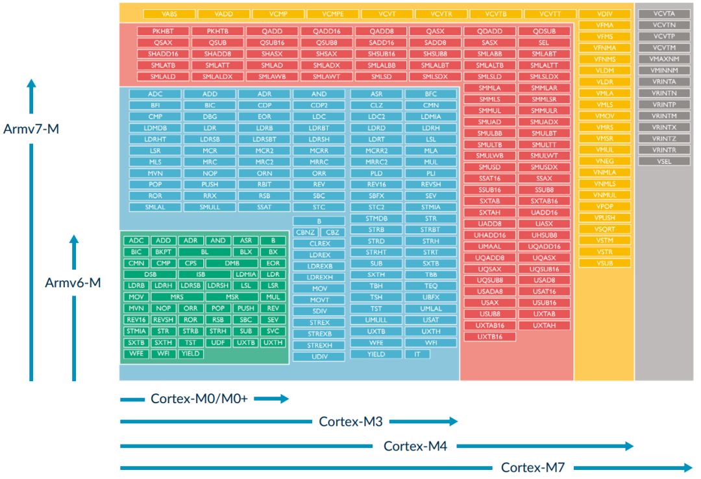
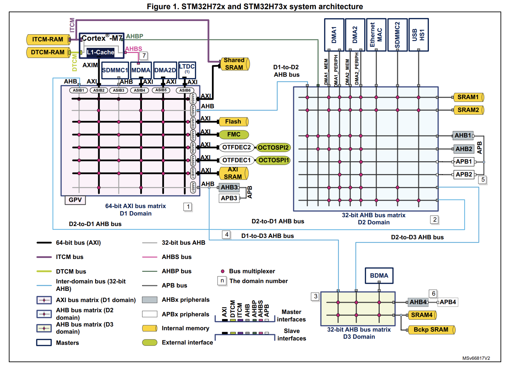

参考资料：
- STM32 MPU 完整介绍 [**ST AN4838** Introduction to memory protection unit management on STM32 MCUs](https://www.st.com/resource/en/application_note/an4838-managing-memory-protection-unit-in-stm32-mcus-stmicroelectronics.pdf)
- STM32H7 体系结构介绍 以及 不同存储设置下的性能对比 [**ST AN4891** STM32H72x, STM32H73x, and single-core STM32H74x/75x system architecture and performance](https://www.st.com/resource/en/application_note/an4891-stm32h72x-stm32h73x-and-singlecore-stm32h74x75x-system-architecture-and-performance-stmicroelectronics.pdf)

## 0x01 前情提要

去年搞了一块挣点元子的 H743IIT6 核心板和一块 1024*800 的七寸 LTDC RGB 电容触摸屏，核心板上是带一片 SDRAM 的，挂在 FMC 上，正好给屏幕做显存用。

当时用的是 CubeMX + Keil MDK5 + AC6 工具链。

当时还没仔细研究过 MPU，以为是在相对比较复杂的工程中使用的，方便工程资源管理。于是拿 CubeMX 配置的时候，一直都选的是 `NOT USED`。
至于 Cache，听起来就是能够加速运算的好东西，于是把 I-Cache 和 D-Cache 都勾上了。

然后死的很惨烈，天天花式螺旋升天，各种诡异问题层出不穷。当时发现 AC5/AC6 编译器的选择和不同的编译优化等级都会影响代码执行结果，和闹鬼了一样，一直以为是 Keil 和编译器的问题。

单独配置 SDRAM 和屏幕的时候好像还没出现什么问题。
后来把 ADC 采样和大点数 FFT 计算加上的时候，就出现了各种诡异的问题。

比如屏幕会有闪烁纹，ADC 采样的数据更新异常，在触摸中断里面修改的变量失效之类的。
虽然当时靠给变量加上 `volatile` 修饰符之类的办法让整个工程跑起来了，但还是感觉不太好，而且要往里面加点新功能的时候也不太方便，很容易暴毙，当时搞的痛不欲生。

~~再然后，电赛封箱前一天的下午，LTDC的屏幕挂掉了，屏幕全黑，原因未知，留下了深刻的心理阴影。于是自闭了半年，发誓什么“这辈子都不会再摸H7一下”之类的。~~

后面就跑去玩 STM32G4 了，有单精度浮点加速单元，还有全新的 Cordic 和 FMAC 加速器外设，玩的很开心。

最近发现 STM32 的 H72x 和 H73x 系列的产品线都装上了 Cordic 和 FMAC。
看资料这个是相对比较新的产品线，ST 在 2020 年发布的，比 H74x 和 H75x 晚四年，优化了主频和功耗。（大火炉 H743 没给我留下好印象，摸起来很烫手，生怕那天芯片自己烧挂了。中间确实换过一块 H743IIT6 核心板，疑似工作电流太大 LDO 没撑住，短路把 5V 电压引到 H7 上电死了......................）

对比 G4 系列 12bit 的 ADC，H7 全线都是 16bit 的，感觉这部分的优势很大。

于是吸取教训，搞了一块 H723ZGT6 和一块 2 寸 SPI 小屏。打算重新把 STM32H7 内存相关的东西搞明白。

## 0x02 STM32H7 体系结构

### M7 内核

Cortex-M7 基于 ARMv7-M，6 级超标量流水线，双发射，带分支预测。带双精度 FPU。

STM32H72x/73x 有 32 KB 的 I-Cache 和 32 KB 的 D-Cache，和核心同频，CPU零等待。哈佛架构同时取指令和数据这一块。

### 存储结构

Internal memory summary of the STM32H72x and STM32H73x

| Memory type | Memory region | Address start | Size        | Access interfaces | Domain | Maximum frequency |
|:----------:|:------------:|:------------:|:----------:|:----------------:|:------:|:----------------:|
| Flash memory | FLASH-1    | 0x0800 0000  | 1 Mbyte    | AXI (64 bits)    | D1     | 275 MHz          |
| RAM        | DTCM-RAM     | 0x2000 0000  | 128 Kbytes | DTCM (64 bits)   | D1     | 550 MHz          |
| RAM        | ITCM-RAM     | 0x0000 0000  | 64 Kbytes  | ITCM (64 bits)   | D1     | 550 MHz          |
| RAM        | AXI SRAM     | 0x2400 0000  | 320 Kbytes | AXI (64 bits)    | D1     | 275 MHz          |
| RAM        | SRAM1        | 0x3000 0000  | 16 Kbytes  | AHB (32 bits)    | D2     | 275 MHz          |
| RAM        | SRAM2        | 0x3000 4000  | 16 Kbytes  | AHB (32 bits)    | D2     | 275 MHz          |
| RAM        | SRAM4        | 0x3800 0000  | 64 Kbytes  | AHB (32 bits)    | D3     | 275 MHz          |
| RAM        | Backup SRAM  | 0x3880 0000  | 4 Kbytes   | AHB (32 bits)    | D3     | 275 MHz          |

其中，AXI SRAM 有 192 KB 可以被重配置为 ITCM，配置粒度为 64 KB。

可以看到 紧密耦合内存（TCM）直连 M7 Core，和核心跑在相同频率上，不经过 Cache，CPU零等待，妥妥的一等公民。

ITCM 的接口是单个 64bit，DTCM 的接口是两个 32bit。AN4891 明确提及 DTCM 也可用于取指令。

> GPT5.5的解释：\
> 为什么 DTCM 是两个 32-bit 端口？因为 Cortex-M7 的数据访问经常有 load/store 并行需求，例如：c[i] = a[i] + b[i];\
> 这类代码会频繁读写数据。DTCM 的设计更适合数据通路。\
> 为什么 ITCM 是 64-bit？因为取指希望一次喂给流水线更多指令，尤其 Thumb-2 有 16/32-bit 混合指令，64-bit fetch 对连续指令流更友好。

片内的 Flash 和其他 SRAM 的频率，最快只能有主频的一半，会经过 Cache，根据不同的配置，会执行不同的缓存策略。

片外配置的存储器，也同样会经过 Cache，也能被缓存加速。

## 0x03 MPU 介绍

施工中......